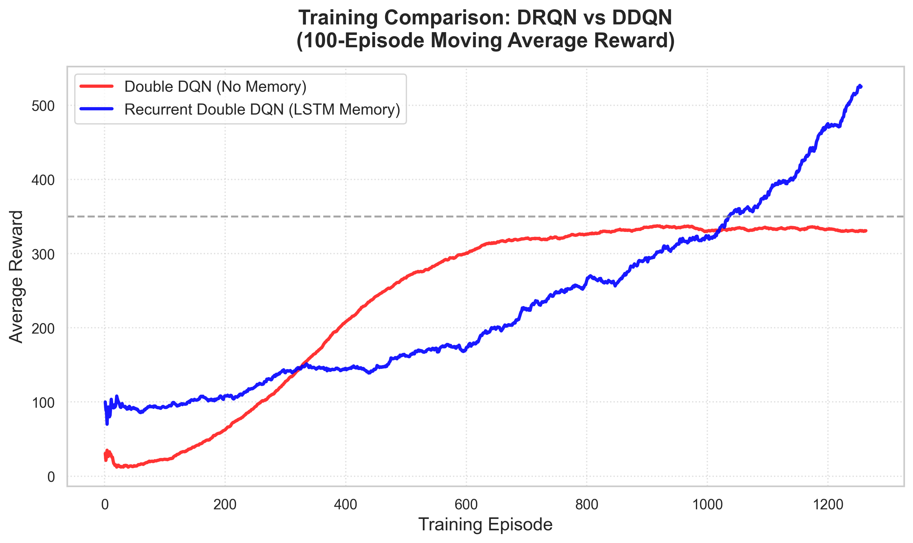

# Seaquest RL Agent: Memory Solves the Oxygen Bottleneck

This repository contains an advanced Reinforcement Learning agent built to play the classic Atari 2600 game **Seaquest** from raw pixel observations. 

Through iterative development, the agent evolved from a simple Convolutional Neural Network (CNN) using Double DQN, to a sophisticated **Recurrent Double DQN (DRQN)** featuring Long Short-Term Memory (LSTM). It interfaces with the Arcade Learning Environment (ALE) via Gymnasium.

## The Evolution of the Agent

### 1. Untrained Baseline
Without training, a random agent acts erratically, failing to avoid enemies or manage oxygen. Average score: **0-20 points**.

### 2. Double DQN (The "Oxygen Bottleneck")
We successfully trained a standard **Double DQN** (CNN-only) for 1,000,000 steps. 
- **Achievements:** It learned to shoot enemies and dodge obstacles, averaging **300-350 points**.
- **The Fatal Flaw:** The agent only "saw" a stack of the last 4 frames (a fraction of a second). To survive in Seaquest, you must collect a diver and then surface for oxygen. Because it had no long-term memory, it would collect a diver, fight sharks for 10 seconds, and completely forget it had a diver. It would try to surface for air and die instantly. It **never** survived the second oxygen cycle.

### 3. Recurrent Double DQN (The Solution)
To make the agent smarter, we implemented a **Recurrent Double DQN (DRQN)**. By injecting an LSTM layer after the CNN, the agent gained an internal "hidden state" that persists over time. 
- **The Result:** The agent successfully learned to remember when it collected a diver! During a rigorous 20-episode evaluation, it reached low oxygen 161 times, and successfully resurfaced 81 times. 
- **Score:** Because it survived multiple oxygen cycles, its average score skyrocketed to **516 points**, with peaks hitting **900 points**.



## Architecture Details

### Observation Processing
The agent learns directly from raw visual input:
- **Grayscale Conversion & Resizing**: The raw RGB frames are converted to grayscale and downsampled to 84x84 pixels.
- **Normalization**: Pixel values (uint8) are scaled to `[0, 1]`.

### Neural Network (DRQN)
The Recurrent Q-network is designed to process temporal sequences:
1. **Conv1**: 32 filters, 8x8 kernel, stride 4
2. **Conv2**: 64 filters, 4x4 kernel, stride 2
3. **Conv3**: 64 filters, 3x3 kernel, stride 1
4. **LSTM Layer**: 512-dimensional hidden state to maintain temporal memory across frames.
5. **Output**: 18 linear units corresponding to the 18 possible Atari actions.

### Sequence-Aware Replay Buffer
To train the LSTM, the experience replay buffer was rewritten to sample valid **temporal sequences** (length 8) rather than isolated random frames, ensuring the LSTM learns how events unfold over time.

## Installation

We recommend using Conda to manage the environment:

```bash
conda create -n aimltrain python=3.10
conda activate aimltrain
pip install -r requirements.txt
```

### ROM Setup
To comply with copyright laws, the Atari ROMs are **not distributed** in this repository. You must legally obtain the Seaquest ROM via AutoROM:
```bash
AutoROM --accept-license
```

## Usage

### Training the DRQN Agent
To train the memory-enabled agent from scratch (Warning: training LSTMs sequentially takes longer than standard CNNs. Expect 3-5 hours on an Apple Silicon M-series chip):
```bash
python -m src.train_recurrent \
    --steps 1000000 \
    --batch-size 32 \
    --log-dir logs/training_drqn \
    --checkpoint-dir models/checkpoints_drqn \
    --device mps
```
*(Note: Use `--device cuda` or `--device cpu` depending on your hardware.)*

### Evaluating the Agent
To evaluate the agent and specifically track its oxygen management behavior:
```bash
python -m src.evaluate_recurrent \
    --checkpoint models/checkpoints_drqn/drqn_step_1000000.pt \
    --episodes 20 \
    --track-oxygen
```

### Watching the Agent
To visually render the smart agent playing the game:
```bash
python -m src.watch_recurrent_agent \
    --checkpoint models/checkpoints_drqn/drqn_step_1000000.pt \
    --episodes 3
```

## Testing
Run the deterministic unit test suite to verify the recurrent architecture and sequence buffers:
```bash
PYTHONPATH=. pytest tests/
```
